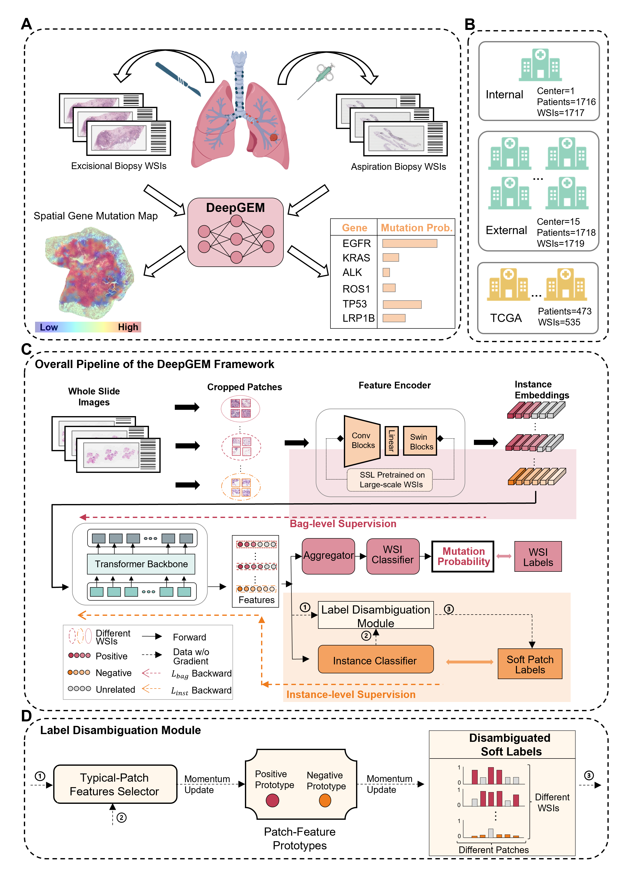

# DeepGEM

## Deep multiple instance learning-enabled gene mutation prediction of lung cancer from histopathology images

We introduce a deep multiple instance learning-enabled artificial intelligence (AI) system (termed as **DeepGEM** for **Deep** **GE**ne **M**utation) to provide driver gene mutation prediction from routinely acquired histology slides without the need of manual annotation. Our model integrates a variety of advanced deep learning approaches and concepts, including self-supervised learning, weakly-supervised multiple instance learning, noisy label learning, transformer architecture, and label disambiguation. DeepGEM has shown the potential to be an economical, timely, and accurate gene mutation prediction tool for guiding clinical drug recommendations for lung cancer patients.
- [DeepGEM](#deepgem)
  - [Deep multiple instance learning-enabled gene mutation prediction of lung cancer from histopathology images](#deep-multiple-instance-learning-enabled-gene-mutation-prediction-of-lung-cancer-from-histopathology-images)
- [System requirements](#system-requirements)
  - [Hardware requirements](#hardware-requirements)
  - [Software requirements](#software-requirements)
    - [OS requirements](#os-requirements)
    - [Python dependencies](#python-dependencies)
- [Pathological Image preprocessing](#pathological-image-preprocessing)
- [Install guide](#install-guide)
  - [For docker users](#for-docker-users)
    - [1-Pull docker images from docker-hub.（optional）](#1-pull-docker-images-from-docker-huboptional)
    - [2-Use docker file `deepgem.tar`.（optional)](#2-use-docker-file-deepgemtaroptional)
    - [3-Start your docker and run examples:](#3-start-your-docker-and-run-examples)
  - [For conda users](#for-conda-users)
    - [1-Configure the enviroment.](#1-configure-the-enviroment)
    - [2-Running Sample (Tested):](#2-running-sample-tested)
    - [3-Running (Needing to download the data first, please refer to the Dataset section for more details.):](#3-running-needing-to-download-the-data-first-please-refer-to-the-dataset-section-for-more-details)
- [Dataset](#dataset)
- [Disclaimer](#disclaimer)
- [Coypright](#coypright)
- [Contact](#contact)




# System requirements
## Hardware requirements
`DeepGEM` package requires only a standard computer with enough RAM and a NVIDIA GPU to support operations.
## Software requirements
### OS requirements
This tool is supported for Linux. The tool has been tested on the following systems: <br>
+ CentOS Linux release 8.2.2.2004
+ Ubuntu 18.04.5 LTS
### Python dependencies
`DeepGEM` mainly depends on the Python scientific stack.   <br>


+ The important packages including:
```
    albumentations==1.1.0
    efficientnet_pytorch==0.7.1
    lifelines==0.26.4
    numpy==1.21.6
    opencv_contrib_python==4.8.0.74
    opencv_python==4.4.0.46
    opencv_python_headless==4.2.0.34
    openslide_python==1.2.0
    pandas==1.3.5
    Pillow==8.4.0
    rich==10.16.1
    scikit_image==0.19.1
    scikit_learn==1.0.1
    torch==1.7.1+cu110
    torchvision==0.8.2+cu110
    tqdm==4.62.3
    yacs==0.1.8
    h5py==2.9.0
    numba==0.44
    torchtuples==0.2.0
```
+ Install the modified [timm](https://drive.google.com/file/d/1JV7aj9rKqGedXY1TdDfi3dP07022hcgZ/view?usp=sharing) library
+ `./DeepGEM/requirements.txt` describes more details of the requirements.    


# Pathological Image preprocessing  #
This code uses the centralized configs. Before using this code, a config file needs to be edited to assign necessary parameters. A sample config file named 'default.yaml' is provided as the reference.

    ./main/configs/default.yaml

1、First, in order to split the WSI into patches, execute the following script.

    python ./data_prepare/step1_WSI_cropping.py  \
      --dataset ./sample_data/WSI  \
      --output ./sample_data/patch  \
      --scale 20 --patch_size 1120 --num_threads 16

2、Then, remove background patches.

    python ./data_prepare/step2_get_patch_list_rmbk_mp.py  \
        --dataset ./sample_data/patch  \
        --output ./sample_data

3、Then, extract features from each patch. a pre-trained feature extractor can be utilized here (e.g. CTranspath trained in WSIs or EfficientNet-B0 trained on the ImageNet). 

    python ./data_prepare/step3_extract_feature.py --cfg ./configs/sample.yaml

3、Finally, combine features of one WSI.

    python ./data_prepare/step4_merge_patch_feat.py --cfg configs/sample.yaml

# Install guide

## For docker users
### 1-Pull docker images from docker-hub.（optional）
```
docker pull skirophorion/deepgem:latest
```
### 2-Use docker file `deepgem.tar`.（optional)
The docker image file can be found at [WeDrive](https://drive.weixin.qq.com/s?k=AJEAIQdfAAo2MwMVlt)
+ Add docker image by loading the docker file:
```
docker load < deepgem.tar
```

### 3-Start your docker and run examples:
```
docker run --name deepgem --gpus all -it --rm  skirophorion/deepgem:latest /bin/bash

```
+ If there are multiple GPUs in your device and you just want to use only one GPU:
```
docker run --name deepgem --gpus '"device=0"' -it --rm  deepgem:latest /bin/bash
```
+ Test directly because all files are contained in this docker image:
```
    # Run commands in the folder `./DeepGEM`:
    
    cd DeepGEM

    # Sample Dataset
    python ./main/test.py  \
        --cfg ./configs/sample.yaml  \
        --input_data ./sample_data/sample.csv  \
        --feat_dir ./sample_data/combined_feat  \
        --checkpoint ./checkpoints/DeepGEM_TCGA/modelTCGA_ExcisionalBiopsy_EGFR.pickle  \
        --gene EGFR  \
        --wsi_type ExcisionalBiopsy  \
        --save_testfile True  \

    # TCGA Dataset
    python ./main/test.py  \
        --cfg ./configs/tcga.yaml  \
        --input_data ./data/tcga/tcga.pickle  \
        --feat_dir ./data/tcga/combined_feat  \
        --checkpoint ./checkpoints/DeepGEM_TCGA/modelTCGA_ExcisionalBiopsy_EGFR.pickle  \
        --gene EGFR  \
        --wsi_type ExcisionalBiopsy  \
        --save_testfile False  \

    # Internal Dataset
    python ./main/test.py  \
        --cfg ./configs/internal.yaml  \
        --input_data ./data/internal/internal.pickle  \
        --feat_dir ./data/internal/combined_feat  \
        --checkpoint ./checkpoints/DeepGEM/model_ExcisionalBiopsy_EGFR.pickle  \
        --gene EGFR  \
        --wsi_type ExcisionalBiopsy  \
        --save_testfile False  \

    # External Dataset
    python ./main/test.py  \
        --cfg ./configs/internal.yaml  \
        --input_data ./data/external/external.pickle  \
        --feat_dir ./data/external/combined_feat  \
        --checkpoint ./checkpoints/DeepGEM/model_ExcisionalBiopsy_EGFR.pickle  \
        --gene EGFR  \
        --wsi_type ExcisionalBiopsy  \
        --save_testfile False  \
```

## For conda users

### 1-Configure the enviroment.

```
git clone https://github.com/TencentAILabHealthcare/DeepGEM.git
cd ./DeepGEM
conda create -n deepgem python=3.7
conda activate deepgem
pip install -r requirements.txt
pip install timm-0.5.4.tar
conda deactivate
```

### 2-Running Sample (Tested):
+ Run commands in the folder `./DeepGEM`:

```
    conda activate deepgem
    
    # Sample Dataset
    python ./main/test.py  \
        --cfg ./configs/sample.yaml  \
        --input_data ./sample_data/sample.csv  \
        --feat_dir ./sample_data/combined_feat  \
        --checkpoint ./checkpoints/DeepGEM_TCGA//modelTCGA_ExcisionalBiopsy_EGFR.pickle  \
        --gene EGFR  \
        --wsi_type ExcisionalBiopsy  \
        --save_testfile True  \
```

### 3-Running (Needing to download the data first, please refer to the Dataset section for more details.):
+ Run commands in the folder `./DeepGEM`:

```
    conda activate deepgem

    # TCGA Dataset
    python ./main/test.py  \
        --cfg ./configs/tcga.yaml  \
        --input_data ./data/tcga/tcga.pickle  \
        --feat_dir ./data/tcga/combined_feat  \
        --checkpoint ./checkpoints/DeepGEM_TCGA//modelTCGA_ExcisionalBiopsy_EGFR.pickle  \
        --gene EGFR  \
        --wsi_type ExcisionalBiopsy  \
        --save_testfile False  \

    # Internal Dataset
    python ./main/test.py  \
        --cfg ./configs/internal.yaml  \
        --input_data ./data/internal/internal.pickle  \
        --feat_dir ./data/internal/combined_feat  \
        --checkpoint ./checkpoints/DeepGEM/model_ExcisionalBiopsy_EGFR.pickle  \
        --gene EGFR  \
        --wsi_type ExcisionalBiopsy  \
        --save_testfile False  \

    # External Dataset
    python ./main/test.py  \
        --cfg ./configs/internal.yaml  \
        --input_data ./data/external/external.pickle  \
        --feat_dir ./data/external/combined_feat  \
        --checkpoint ./checkpoints/DeepGEM/model_ExcisionalBiopsy_EGFR.pickle  \
        --gene EGFR  \
        --wsi_type ExcisionalBiopsy  \
        --save_testfile False  \
```

# Dataset

Example data are given in `./sample_data`.

The DeepGEM source code, as well as the trained DeepGEM models, are also available on [Zenodo](https://zenodo.org/record/11056852).

# Disclaimer
This tool is for research purpose and not approved for clinical use.

# Coypright

This tool is developed in Tencent AI Lab.

The copyright holder for this project is Tencent AI Lab.

All rights reserved.

# Contact

Please get in touch with louisyuzhao@tencent.com if you have any questions. 